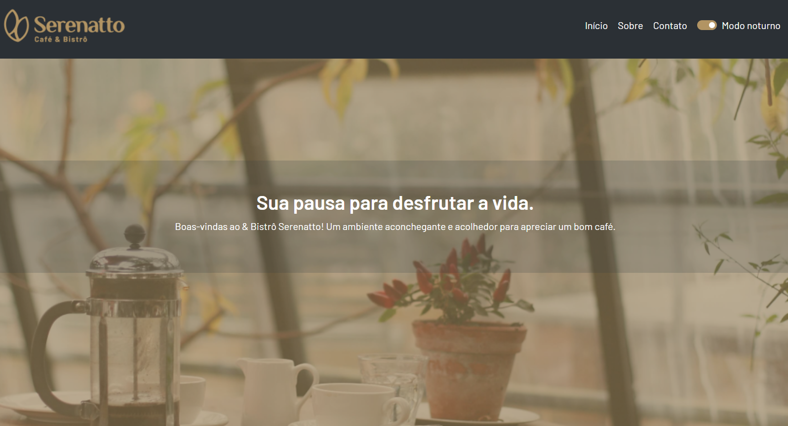

# Serenatto

O Serenatto é uma landing page fictícia sem fins comerciais. Para que busca aquela página para seu site estilosa, Serenatto tem tudo a ver.

## 🔨 Funcionalidades do projeto

O projeto foi desenvolvido em várias tecnologias. As principais delas foram javascript e bootstrap. Dando um estilo a landing page. Pode ser encontrado no [Figma](https://www.figma.com/design/1jsN5KMprfMLOrYc8QrJZh/Serenatto-%7C-2985---Bootstrap-5--Curso-2?node-id=116-73325&t=nH8DxKih5VaZbHg9-0) para versões mobile, tablet e desktop.

## ✔️ Técnicas e tecnologias utilizadas

-`HTML`
-`CSS`
`Javascript`
-`Bootstrap`
-`Acessibilidade Web`
-`Figma`

## 🛠️ Abrir e rodar o projeto

Para abrir e rodar o projeto, utilize um editor de código de sua escolha.
Depois, abra o projeto no seu navegador.

## 📚 Mais informações

O Meteora é uma empresa fictícia utilizada para aperfeiçoar as habilidades.
A ideia principal desse projeto é evoluir ainda mais os conhecimentos em HTML e CSS e principalmente focado em bootstrap.

## VERCEL 
https://cafeteria-alpha-brown.vercel.app/#
